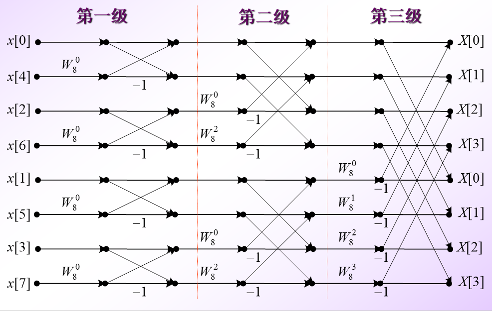
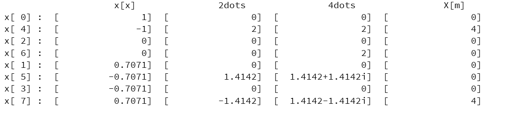

# FftStep

快速傅里叶变换(FFT) 的步骤输出

只支持输入长度为2^n 的序列。

为了理解简单，没有进行优化，不建议工作使用。 

```$xslt
Ffter ffter = new Ffter();
        Complex.setDotLength(4);//设置小数点位数
        Ffter.COLUMN_WIDTH=16;//设置输出宽度16字符

        Complex[] cos2PikD8 = Sequences.generate(8,
                k -> new Complex(Math.cos((2*Math.PI*k)/8))
        );
        //cos (2pi*k/8) 序列

        Complex[] result = ffter.fft(cos2PikD8);//结果序列

        ffter.printStepsVec();//输出流程

```

```$xslt
                    x[x]               2dots               4dots                X[m]  
x[ 0] :  [               1]  [               0]  [               0]  [               0] 
x[ 4] :  [              -1]  [               2]  [               2]  [               4] 
x[ 2] :  [               0]  [               0]  [               0]  [               0] 
x[ 6] :  [               0]  [               0]  [               2]  [               0] 
x[ 1] :  [          0.7071]  [               0]  [               0]  [               0] 
x[ 5] :  [         -0.7071]  [          1.4142]  [  1.4142+1.4142i]  [               0] 
x[ 3] :  [         -0.7071]  [               0]  [               0]  [               0] 
x[ 7] :  [          0.7071]  [         -1.4142]  [  1.4142-1.4142i]  [               4] 

```
#### 基2时间抽取FFT算法流图


输出预览。



